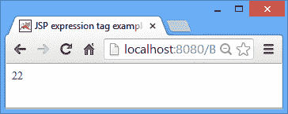
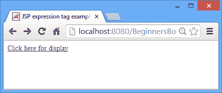
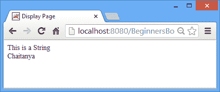

# JSP 表达式标签

> 原文： [https://beginnersbook.com/2013/11/jsp-expression-tag/](https://beginnersbook.com/2013/11/jsp-expression-tag/)

表达式标签评估放置在其中的表达式，将结果转换为`String`并通过[`response`对象](https://beginnersbook.com/2013/11/jsp-implicit-object-response-with-examples/ "Response implicit object")将结果发送回客户端。基本上它将结果写入客户端（浏览器）。

**JSP 中表达式标签的语法：**

```html
<%= expression %>
```

## JSP 表达式标签示例

**例 1：值的表达**

这里我们只是在表达式标签内传递值的表达式。

```html
<html>
 <head>
   <title>JSP expression tag example1</title>
 </head>
 <body>
   <%= 2+4*5 %>
 </body>
 </html>
```

**输出：**



**例 2：变量的表达式**

在这个例子中，我们初始化了几个变量，并在表达式标签中传递变量表达式以进行结果评估。

```html
<html>
<head>
   <title>JSP expression tag example2</title>
</head>
<body>
  <%
  int a=10;
  int b=20;
  int c=30;
  %>
  <%= a+b+c %>
</body>
</html>
```

**输出：**


**示例 3：字符串和隐式对象输出**

在此示例中，我们使用[`application`隐式对象](https://beginnersbook.com/2013/11/jsp-implicit-object-application-with-examples/ "Application object")设置属性，然后使用表达式标签在另一个 JSP 页面上显示该属性和一个简单字符串。

`index.jsp`

```html
<html>
<head>
<title> JSP expression tag example3 </title>
</head>
<body>
  <% application.setAttribute("MyName", "Chaitanya"); %>
  <a href="display.jsp">Click here for display</a>
</body>
</html>
```

`display.jsp`

```html
<html>
<head>
<title>Display Page</title>
</head>
<body>
 <%="This is a String" %><br>
 <%= application.getAttribute("MyName") %>
</body>
</html>
```

**输出：**



