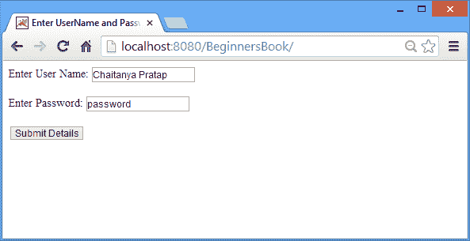
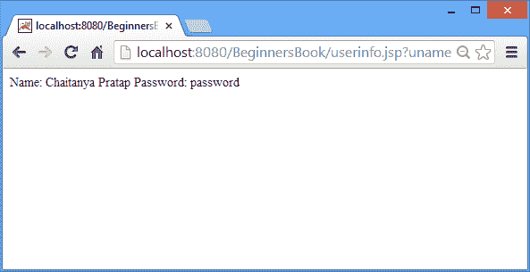

# 使用示例在 JSP 中请求隐式对象

> 原文： [https://beginnersbook.com/2013/11/jsp-implicit-object-request-with-examples/](https://beginnersbook.com/2013/11/jsp-implicit-object-request-with-examples/)

这里我们将讨论 JSP 中的请求隐式对象。它主要用于获取用户在之前的 JSP 页面上输入的 JSP 页面上的数据。

### 请求隐式对象的方法

1.  **getParameter（String name）** - 此方法用于获取请求参数的值。例如，在登录页面，用户输入用户 ID 和密码，一旦验证了凭证，登录页面就会被重定向到用户信息页面，然后使用 request.getParameter 我们可以获得用户输入的用户 ID 和密码的值。登录页面。

    ```
           String Uid= request.getParameter("user-id");
           String Pass= request.getParameter("password");
    ```

2.  **getParameterNames（） -** 它返回与请求关联的所有参数名称的枚举。

    ```
           Enumeration e= request.getParameterNames();
    ```

3.  **getParameterValues（String name） -** 它返回参数值数组。

    ```
           String[] allpasswords = request.getParameterValues("password");
    ```

4.  **getAttribute（String name） -** 用于获取属性值。 request.getAttribute（“admin”）将为您提供属性 admin 的值。
5.  **getAttributeNames（） -** 它通常用于获取与当前会话关联的属性名称。它返回会话中存在的属性名称的枚举。

    ```
           Enumerator e = request.getAttributeNames();
    ```

6.  **setAttribute（String，Object） -** 它将一个对象的值赋给该属性。例如，我有一个属性**密码**和一个 String 对象 str，其值为**“admin”**然后调用 request.setAttribute（“password”，str）将赋值 **admin** 到属性**密码**。
7.  **removeAttribute（String） -** 通过使用此方法，可以删除属性，不能进一步使用。对于例如如果在 JSP 页面上有声明 **request.removeAttribute（“userid”）**，那么 userid 属性将被完全删除，而 request.getAttribute（“userid”）将返回 **NULL** 在 removeAttribute 方法之后使用。
8.  **getCookies（） -** 它返回从客户端收到的 cookie 对象数组。此方法主要用于处理 JSP 中的 cookie。
9.  **getHeader（String name） -** 此方法用于获取请求的头信息。
10.  **getHeaderNames（） -** 返回所有标题名称的枚举数。下面的代码片段将显示与请求关联的所有标头名称。

    ```
            Enumeration e = request.getHeaderNames();
                 while (enumeration.hasMoreElements()) {
                     String str = (String)e.nextElement();
                     out.println(str);
                 }
    ```

11.  **getRequestURI（） -** 此方法（request.getRequestURI（））返回当前 JSP 页面的 URL。
12.  **getMethod（） -** 它返回 HTTP 请求方法。 request.getMethod（）。例如，它将为 Get 请求返回 GET，为 Post Request 返回 POST。
13.  **getQueryString（） -** 用于获取与 JSP 页面 URL 关联的查询字符串。它是在问号符号（？）后与 URL 相关联的字符串。

### 请求隐式对象示例

在下面的示例中，我们在 index.html 页面中接收来自用户的输入，并使用请求隐式对象在 userinfo.jsp 页面中显示相同的信息。

index.html

```
<html>
<head>
<title>Enter UserName and Password</title>
</head>
<body>
<form action="userinfo.jsp"> 
Enter User Name: <input type="text" name="uname" /> <br><br>
Enter Password: <input type="text" name="pass" /> <br><br>
<input type="submit" value="Submit Details"/> 
</form>
</body>
</html>
```

userinfo.jsp

```
<%@ page import = " java.util.* " %>
<html> 
<body> 
<% 
String username=request.getParameter("uname"); 
String password=request.getParameter("pass"); 
out.print("Name: "+username+" Password: "+password);
%> 
</body> 
</html>
```

**上述例子**的快照

一旦运行上面的 JSP 代码。它会显示以下屏幕，其中包含两个用户名和密码的文本字段。



这是 **userinfo.jsp** 页面的输出。这里我们获取了用户在登录页面中输入的 id 和密码。



如果您对 JSP 请求隐式对象有任何疑问，请告诉我们。我们很乐意帮助您！！