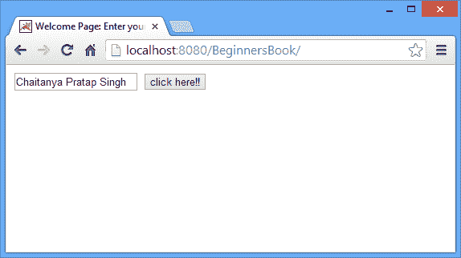
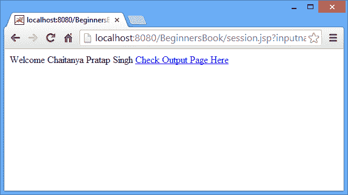
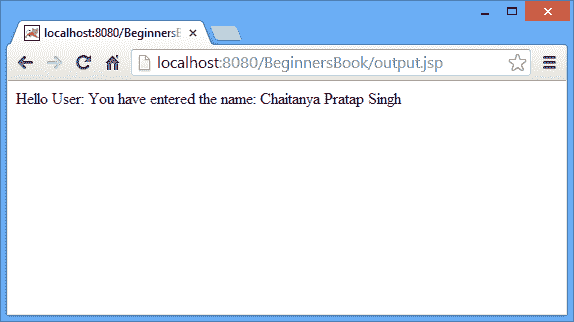

# JSP 中的 Session 隐式对象及其示例

> 原文： [https://beginnersbook.com/2013/11/jsp-implicit-object-session-with-examples/](https://beginnersbook.com/2013/11/jsp-implicit-object-session-with-examples/)

Session 是 JSP 中最常用的隐式对象。它的主要用途是访问所有用户的数据，直到用户会话处于活动状态。

### 会话隐式对象的方法

1.  **setAttribute（String，object） -** 此方法用于通过为对象分配唯一字符串来保存会话中的对象。之后，可以使用相同的 String 从会话中访问该对象，直到会话处于活动状态。 setAttribute 和 getAttribute 是在 JSP 中处理会话时最常用的两种方法。
2.  **getAttribute（String name） -** setAttribute 方法存储的对象是使用 getAttribute 方法从 session 获取的。例如，如果我们需要访问每个 jsp 页面上的 userid，直到会话处于活动状态，那么我们应该使用 setAttribute 方法将 user-id 存储在会话中，并且可以在需要时使用 getAttribute 方法进行访问。
3.  **removeAttribute（String name） -** 可以使用此方法从会话中删除存储在会话中的对象。将唯一字符串标识符作为 removeAttribute 的方法传递。
4.  **getAttributeNames -** 它返回会话中存储的所有对象。基本上，它会导致对象的枚举。
5.  **getCreationTime -** 此方法返回会话创建时间，即会话启动的时间（变为活动状态）。
6.  **getId -** Servlet 容器在创建会话时为会话分配唯一​​的字符串标识符。 **getId** 方法返回该唯一字符串标识符。
7.  **isNew（） -** 用于检查会话是否是新的。它返回布尔值（true 或 false）。主要用于跟踪客户端是否启用了 cookie。如果禁用 cookie，session.isNew（）方法将始终返回 **true** 。
8.  **invalidate（） -** 它会终止会话并中断会话与所有存储对象的关联。
9.  **getMaxInactiveInterval -** 以秒为单位返回会话的最大停用时间间隔。
10.  **getLastAccessedTime -** 通常用于知道会话的最后访问时间。

### 会话隐式对象示例

下面的 html 页面将显示一个文本框和一个提交按钮。提交操作会将控件转移到 session.jsp 页面。

index.html

```html
<html> 
<head>
<title>Welcome Page: Enter your name</title>
</head>
<body> 
<form action="session.jsp"> 
<input type="text" name="inputname"> 
<input type="submit" value="click here!!"><br/> 
</form> 
</body> 
</html>
```

**session.jsp** 页面显示用户在索引页面中输入的名称，它将相同的变量存储在**会话对象**中，以便可以在任何页面上获取它，直到会话变为非活动状

session.jsp

```html
<html> 
<head>
<title>Passing the input value to a session variable</title>
</head>
<body> 
<% 
String uname=request.getParameter("inputname"); 
out.print("Welcome "+ uname);
session.setAttribute("sessname",uname); 
%> 
<a href="output.jsp">Check Output Page Here </a>
</body> 
</html>
```

在这个页面中，我们从 session 对象中获取变量的值并显示它。

output.jsp

```html
<html> 
<head>
<title>Output page: Fetching the value from session</title>
</head>
<body> 
<% 
String name=(String)session.getAttribute("sessname"); 
out.print("Hello User: You have entered the name: "+name); 
%> 
</body> 
</html>
```

**输出屏幕**





