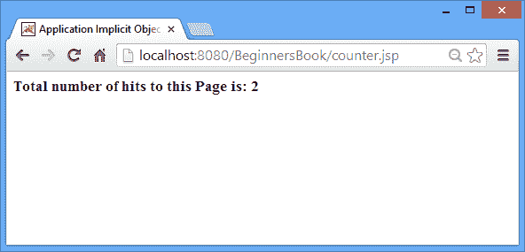

# JSP 中的`application`隐式对象

> 原文： [https://beginnersbook.com/2013/11/jsp-implicit-object-application-with-examples/](https://beginnersbook.com/2013/11/jsp-implicit-object-application-with-examples/)

`Application`隐式对象是`javax.servlet.ServletContext`的一个实例。它主要用于获取初始化参数和共享属性和它们在整个 JSP 应用中的值，这意味着`application`隐式对象设置的任何属性都可用于所有 JSP 页面。

**方法：**

*   `Object getAttribute(String attributeName)`
*   `void setAttribute(String attributeName, Object object)`
*   `void removeAttribute(String objectName)`
*   `Enumeration getAttributeNames()`
*   `String getInitParameter(String paramname)`
*   `Enumeration getInitParameterNames()`
*   `String getRealPath(String value)`
*   `void log(String message)`
*   `URL getResource(String value)`
*   `InputStream getResourceAsStream(String path)`
*   `String getServerInfo()`
*   `String getMajorVersion()`
*   `String getMinorVersion()`

1.  `Object getAttribute(String attributeName)`：它返回存储在给定属性名称中的对象。例如，下面的语句将返回存储在属性`"MyAttr"`中的对象。

    ```html
        String s = (String)application.getAttribute("MyAttr");
    ```

2.  `void setAttribute(String attributeName, Object object)`：它设置属性的值，或者换句话说，它将属性及其值存储在应用程序上下文中，可在整个 JSP 应用程序中使用。示例 –

    ```html
        application.setAttribute(“MyAttribute”, “This is the value of Attribute”);
    ```

    上面的语句将存储属性及其值。如果我们在任何 JSP 页面中使用以下语句，那么`'s'`的值是多少？

    ```html
        String s= (String) application.getAttribute(“MyAttribute”);
    ```

    字符串的值将是`"This is the value of Attribute"`，因为我们使用`setAttribute`方法设置它。

3.  `void removeAttribute(String objectName)`：此方法用于从应用中删除给定属性。对于例如 - 它将从应用中删除属性`"MyAttr"`。如果我们尝试使用`getAttribute`方法获取已删除属性的值，则它将返回`Null`。

    ```html
        application.removeAttribute(“MyAttr”);
    ```

4.  `Enumeration getAttributeNames()`：此方法返回存储在`application`隐式对象中的所有属性名称的枚举。

    ```html
        Enumeration e= application.getAttributeNames();
    ```

5.  `String getInitParameter(String paramname)`：它返回给定参数名称的`Initialization`参数的值。示例`web.xml`：

    ```html
        <web-app>
        …
        <context-param>
        <param-name>parameter1</param-name>
        <param-value>ValueOfParameter1</param-value>
        </context-param>
        </web-app>
    ```

    假设上面是我的`web.xml`文件

    ```html
        String s=application.getInitParameter(“parameter1”);
    ```

    `s`的值将是`ValueOfParameter1`。仍然困惑它来自哪里？请参阅`web.xml`文件中的`param-value`标签。

6.  `Enumeration getInitParameterNames()`：它返回所有`Initialization`参数的枚举。

    ```html
        Enumeration e= application.getinitParameterNames();
    ```

7.  `String getRealPath(String value)`：它将给定路径转换为文件系统中的绝对路径。

    ```html
        String abspath = application.getRealPath(“/index.html”);
    ```

    `abspath`的值将是基于现有文件系统的完整 HTTP URL。

8.  `void log(String message)`：此方法将给定消息写入与该应用程序关联的 JSP 引擎（JSP 容器）的默认日志文件。

    ```html
        application.log(“This is error 404 Page not found”);
    ```

    上面的调用会将消息`"This is error 404 Page not found"`写入默认日志文件。

9.  `String getServerInfo()`：此方法返回 JSP 容器（JSP 引擎）的名称和版本。

    ```html
        application.getServerInfo();
    ```

**`application`隐式对象示例**

一个 JSP 页面，用于捕获使用应用的命中数。在此示例中，我们使用`application`隐式对象计算 JSP 页面的命中数。

`counter.jsp`

```html
<%@ page import="java.io.*,java.util.*" %>
<html>
<head>
<title>Application Implicit Object Example</title>
</head>
<body>
<%
 //Comment: This would return null for the first time
 Integer counter= (Integer)application.getAttribute("numberOfVisits");
 if( counter ==null || counter == 0 ){
 //Comment: For the very first Visitor 
 counter = 1;
 }else{
 //Comment: For Others 
 counter = counter+ 1;
 }
 application.setAttribute("numberOfVisits", counter);
%>
<h3>Total number of hits to this Page is: <%= counter%></h3>
</body>
</html>
```

**输出截图**

首次访问者的点击次数为 1。


刷新页面时，点击次数增加了。



如果您喜欢该教程，请在 Facebook 和 Google+ 上与您的朋友分享。