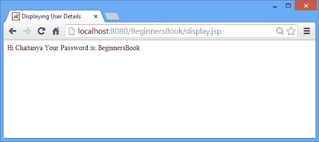

# pageContext JSP 中的隐式对象，带有示例

> 原文： [https://beginnersbook.com/2013/11/jsp-implicit-object-pagecontext-with-examples/](https://beginnersbook.com/2013/11/jsp-implicit-object-pagecontext-with-examples/)

它是 **javax.servlet.jsp.PageContext** 的一个实例。使用此对象，您可以在以下任何级别找到属性，获取属性，设置属性和删除属性 -

1.  JSP 页面 - 范围：PAGE_CONTEXT
2.  HTTP 请求 - 范围：REQUEST_CONTEXT
3.  HTTP 会话 - 范围：SESSION_CONTEXT
4.  应用级别 - 范围：APPLICATION_CONTEXT

**快速链接：**

*   [pageContext 隐式对象完整示例](#example)
*   [示例输出](#output)的屏幕截图

### pageContext 隐式对象的方法

1.  **Object findAttribute（String AttributeName）：**此方法按以下顺序搜索所有四个级别中的指定属性 - 页面，请求，会话和应用。当在任何级别找不到属性时，它返回 NULL。
2.  **Object getAttribute (String AttributeName, int Scope):** It looks for an attribute in the specified scope. This method is similar to findAttribute method; the only difference is that findAttribute looks in all the four levels in a sequential order while getAttribute looks in a specified scope. For e.g. – In the below statement the getAttribute method would search for the attribute “BeginnersBook” in **Session scope (or Session level/layer).** If it finds the attribute it would assign it to Object obj else it would return Null.

    ```
        Object obj = pageContext.getAttribute("BeginnersBook", PageContext.SESSION_CONTEXT);
    ```

    同样，该方法也可用于其他范围 -

    ```
        Object obj = pageContext.getAttribute("BeginnersBook", PageContext. REQUEST_CONTEXT);
        Object obj = pageContext.getAttribute("BeginnersBook", PageContext. PAGE_CONTEXT);
        Object obj = pageContext.getAttribute("BeginnersBook", PageContext. APPLICATION_CONTEXT);
    ```

3.  **void removeAttribute（String AttributeName，int Scope）：**此方法用于从给定范围中删除属性。例如 - 下面的 JSP 语句将从页面范围中删除属性“MyAttr”。

    ```
        pageContext.removeAttribute(“MyAttr”, PageContext. PAGE_CONTEXT);
    ```

4.  **void setAttribute(String AttributeName, Object AttributeValue, int Scope):** It writes an attribute in a given scope. Example – Below statement would store an Attribute “mydata” in application scope with the value “This is my data”.

    ```
        pageContext.setAttribute(“mydata”, “This is my data”, PageContext. APPLICATION_CONTEXT);
    ```

    类似地，这将在 Request 范围中创建名为 attr1 的属性，其值为“Attr1 value”。

    ```
        pageContext.setAttribute(“attr1”, “Attr1 value”, PageContext. REQUEST_CONTEXT);
    ```

### pageContext 隐式对象示例

index.html

在这里，我们只是要求用户输入登录详细信息。

```
<html>
<head>
<title> User Login Page – Enter details</title>
</head>
<body>
<form action="validation.jsp">
Enter User-Id: <input type="text" name="uid"><br>
Enter Password: <input type="text" name="upass"><br>
<input type="submit" value="Login">
</form>
</body>
</html>
```

validation.jsp

在此页面中，我们使用 **pageContext** 隐式对象和**会话范围**存储用户凭据，这意味着我们将能够访问详细信息，直到用户的会话处于活动状态。我们还可以使用其他范围参数存储属性，例如页面，应用和请求。

```
<html>
<head> <title> Validation JSP Page</title>
</head>
<body>
<% 
String id=request.getParameter("uid");
String pass=request.getParameter("upass");
out.println("hello "+id);
pageContext.setAttribute("UName", id, PageContext.SESSION_SCOPE);
pageContext.setAttribute("UPassword", pass, PageContext.SESSION_SCOPE);
%>
<a href="display.jsp">Click here to see what you have entered </a>
</body>
</html>
```

display.jsp

在这个 JSP 页面中，我们使用 getAttribute 方法获取存储的属性。这里需要注意的是，我们已经使用会话范围存储了属性，因此我们必须将范围指定为会话才能获取这些属性的值。

```
<html>
<head>
<title>Displaying User Details</title>
</head>
<body>
<%
String username= (String) pageContext.getAttribute("UName", PageContext.SESSION_SCOPE);
String userpassword= (String) pageContext.getAttribute("UPassword", PageContext.SESSION_SCOPE);
out.println("Hi "+username);
out.println("Your Password is: "+userpassword);
%>
</body>
</html>
```

**示例输出的屏幕截图：**

我们从用户接收用户 ID 和密码的登录页面。


有详细页面链接的页面 -


用户凭据显示页面，我们已通过 **pageContext** 实例从登录页面传递到此页面。

如果您对 pageContext 隐式对象有任何疑问，请随时通过删除评论来询问。我们非常乐意为您提供帮助！