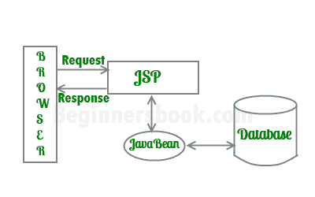
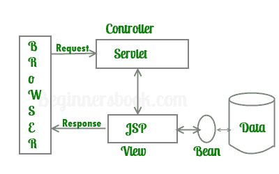

# Java Server Pages 简介 - JSP 教程

> 原文： [https://beginnersbook.com/2013/05/jsp-tutorial-introduction/](https://beginnersbook.com/2013/05/jsp-tutorial-introduction/)

**JSP** 是一种服务器端技术，可以完成服务器上的所有处理。它用于创建动态 Web 应用，使用 java 作为编程语言。

基本上，只需将文件扩展名从“.html”更改为“.jsp”，任何 html 文件都可以转换为 JSP 文件，它运行得很好。 JSP 与 HTML 的区别在于能够在 HTML 中使用 Java 代码。在 JSP 中，您可以使用 JSP 标记在 Java 中嵌入 Java 代码。例如运行下面的代码，每次运行它时，它都会显示当前时间。这就是使这段代码充满活力的原因。

```
<HTML>
<BODY>
Hello BeginnersBook Readers! 
Current time is: <%= new java.util.Date() %>
</BODY>
</HTML>
```

## 你的第一个 JSP

让我们开始用**简单 JSP** 学习 JSP。

```
<%-- JSP comment --%>
<HTML>
<HEAD>
<TITLE>MESSAGE</TITLE>
</HEAD>
<BODY>
<%out.print("Hello, Sample JSP code");%>
</BODY>
</HTML>
```

上面的 JSP 生成以下输出：
**Hello，示例 JSP 代码**。

**上述代码**
的说明 1）行**&lt;% - JSP Comment - %&gt;** 表示名为 JSP Comment 的 JSP 元素，在向 JSP 页面添加注释时可以使用此标记，我们将在后续帖子中详细讨论。
**注意：** JSP 注释必须以标签**&lt;% -** 开头，以 **- %&gt;结尾。**

**2）Head，Title 和 Body 标签是 HTML 标签** - 它们是 HTML 标签，经常用于静态网页。无论他们拥有什么内容，都会传递给客户端（Web 浏览器）。

3）**&lt;%out.print（“Hello，Sample JSP code”）;%&gt;** 是一个 JSP 元素，称为 Scriptlet。 Scriptlet 可以包含 Java 代码。 scriptlet 的**语法是：**&lt;%Executable java code%&gt;。由于 Scriptlets 中的代码是 java 语句，因此它们必须以分号（;）结尾。 out.print（“Hello，示例 JSP 代码”）是一个 java 语句，它打印“Hello，Sample JSP code”。

如上所述，JSP 用于创建动态网页。动态网页通常是静态和网络的混合。动态内容。

**静态内容**可以使用基于文本的格式，如 HTML，XML 等，**动态内容**由 JSP 标签使用 HTML 内部的 Java 代码生成。

## Servlet 与 JSP

与 JSP 一样，Servlet 也用于生成动态网页。这是他们之间的比较。

它们之间的主要区别在于 servlet 在 java 中添加了 HTML 代码，而 JSP 在 HTML 中添加了 Java 代码。还有一些其他值得注意的要点如下：
**Servlets** -

1.  Servlet 是一个支持 HTML 标签的 Java 程序。
2.  通常用于开发企业应用的业务层（复杂计算代码）。
3.  Servlet 由 Java 开发人员创建和维护。

**JSP** -

1.  JSP 程序也是支持 java 语句的 HTML 代码。更准确地说，JSP 使用 JSP 标记在 java 中嵌入 java。
2.  用于开发企业应用的表示层
3.  经常用于设计网站并由 Web 开发人员使用。

## JSP 的优点

1.  JSP 具有 servlet 的所有优点，如：比 CGI 更好的性能内置会话功能，它还继承了 Java 技术的特性，如多线程，异常处理，数据库连接等。
2.  JSP 支持将内容生成与内容呈现分离。这使它更灵活。
3.  使用 JSP，Web 设计人员现在可以轻松地显示需要的信息。
4.  Web 应用程序员可以专注于如何处理/构建信息。

## JSP 应用的体系结构

在我们开始开发 Web 应用之前，我们应该对架构有一个基本的想法。根据请求处理发生的位置（Servlet OR JSP（Java 服务器页面）），JSP 有两种体系结构。它们是 - Model1 Architecture&amp; Model2 架构。
**1）Model1 架构**：在这个模型中，JSP 起着关键作用，它负责处理客户端发出的请求。客户端（Web 浏览器）发出请求，JSP 然后创建一个 bean 对象，然后完成请求并将响应传递给 JSP。 JSP 然后将响应发送回客户端。与 Model2 体系结构不同，在此模型中，大多数处理都是由 JSP 本身完成的。



**2）Model2 架构**：在这个模型中，Servlet 扮演着重要角色，它负责处理客户端（Web 浏览器）请求。演示部分（GUI 部分）将由 JSP 处理，并在 bean 的帮助下完成，如下图所示。 servlet 充当控制器并负责请求处理。如果 jsp 页面需要，它会创建 bean 对象并调用相应的 jsp 页面。 jsp 使用 bean 对象处理表示部分。在这个模型中，JSP 不进行任何处理，Servlet 根据客户端的请求创建 bean Object 并调用 JSP 程序。

