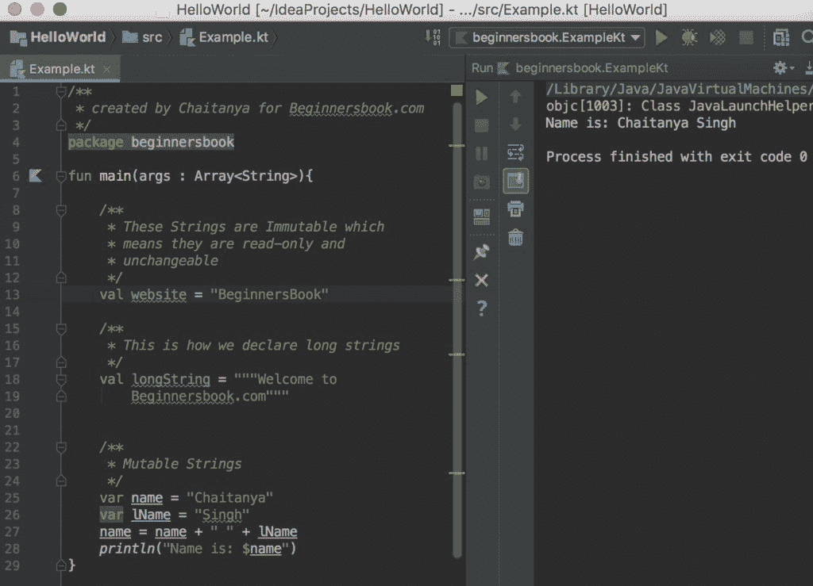
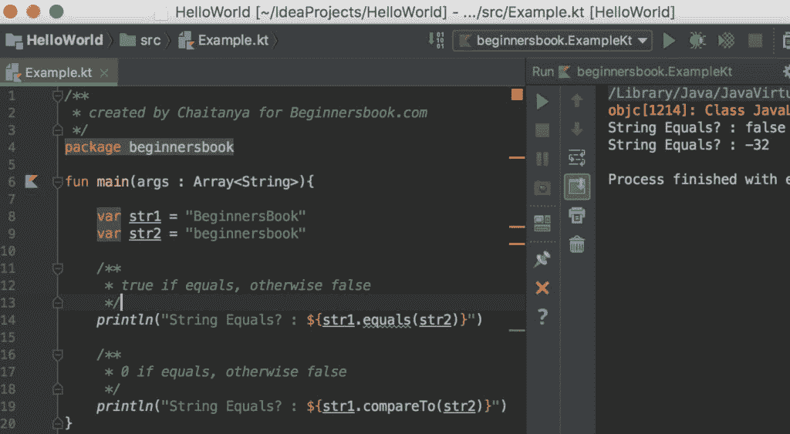
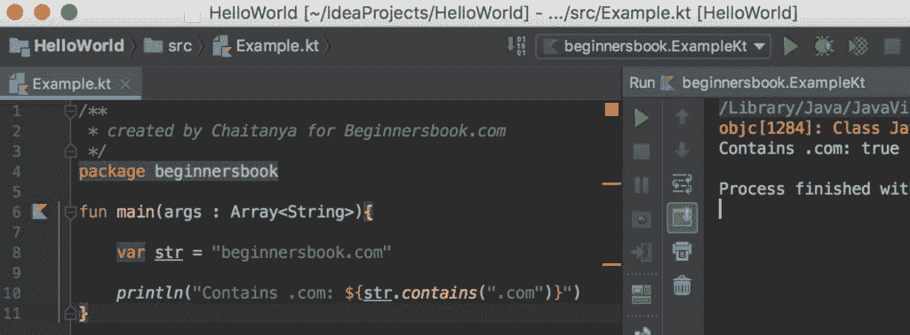

# Kotlin 字符串

> 原文： [https://beginnersbook.com/2019/02/kotlin-string/](https://beginnersbook.com/2019/02/kotlin-string/)

字符串是一系列字符。在本指南中，我们将了解如何在 Kotlin 中声明，使用和操作字符串。

## 在 Kotlin 中声明一个`String`

我们可以在 Kotlin 中定义一个`String`。让我们看一下下面的例子，这里我们已经声明了两个不可变的字符串`website`和`longString`我们还声明了两个可变字符串`name`和`lName`。这个例子还展示了一种简单的字符串连接方式，在 Kotlin 指南中阅读更多参考[字符串连接](https://beginnersbook.com/2017/12/string-concatenation-in-kotlin/)。

```kotlin
/**
 * created by Chaitanya for Beginnersbook.com
 */
package beginnersbook

fun main(args : Array<String>){

    /**
     * These Strings are Immutable which
     * means they are read-only and
     * unchangeable
     */
    val website = "BeginnersBook"

    /**
     * This is how we declare long strings
     */
    val longString = """Welcome to
        Beginnersbook.com"""

    /**
     * Mutable Strings
     */
    var name = "Chaitanya"
    var lName = "Singh"
    name = name + " " + lName
    println("Name is: $name")
}
```

**输出：**



## 在 Kotlin 中获取字符串长度

让我们看看我们如何在 Kotlin 中获得`String`长度。在下面的示例中，我们有一个`String firstName`，我们正在显示该字符串的长度。

```kotlin
/**
 * created by Chaitanya for Beginnersbook.com
 */
package beginnersbook

fun main(args : Array<String>){

    var firstName = "Chaitanya"

    /**
     * String interpolation
     */
    println("String Length: ${firstName.length}")

    /**
     * Or you can display like this
     */
    println("String Length: " + firstName.length)
}
```

**输出：**

```kotlin
String Length: 9
String Length: 9
```

## 比较 Kotlin 中的`String`

让我们举一个例子来比较 Kotlin 中的两个字符串。有两种比较字符串的方法，使用`equals()`方法或使用`compareTo()`方法。

```kotlin
/**
 * created by Chaitanya for Beginnersbook.com
 */
package beginnersbook

fun main(args : Array<String>){

    var str1 = "BeginnersBook"
    var str2 = "beginnersbook"

    /**
     * true if equals, otherwise false
     */
    println("String Equals? : ${str1.equals(str2)}")

    /**
     * 0 if equals, otherwise false
     */
    println("String Equals? : ${str1.compareTo(str2)}")
}
```

**输出：**



## 访问特定索引处的字符串中的字符

我们可以使用`get()`方法从字符串中的特定索引获取字符，该方法等同于 Java 的[`charAt()`方法](https://beginnersbook.com/2013/12/java-string-charat-method-example/)

```kotlin
/**
 * created by Chaitanya for Beginnersbook.com
 */
package beginnersbook

fun main(args : Array<String>){

    var str = "BeginnersBook"

    println("3rd Index: ${str.get(3)}")

    /**
     * Another way of doing the same
     * This is the recommended way
     */
    println("3rd Index: ${str[3]}")
}
```

**输出：**

```kotlin
3rd Index: i
3rd Index: i

```

## 子串

我们可以使用`subSequence()`方法在 Kotlin 中显示子字符串。我们可以在`subSequence(fromIndex, toIndex)`方法中提供`fromIndex`和`toIndex`，其中`fromIndex`是包含性的，`toIndex`是排他性的。

```kotlin
/**
 * created by Chaitanya for Beginnersbook.com
 */
package beginnersbook

fun main(args : Array<String>){

    var str = "BeginnersBook"

    /**
     * Here fromIndex is inclusive and
     * toIndex is exclusive which means
     * 5th index char will not be included
     */
    println("Index from 2 to 5: " +
    str.subSequence(2,5))
}
```

**输出：**

```kotlin
Index from 2 to 5: gin
```

## 检查`String`是否包含另一个`String`

我们可以使用`contains()`方法来检查给定的字符串是否包含指定的字符串。让我们举个例子来理解`contains()`的用法

```kotlin
/**
 * created by Chaitanya for Beginnersbook.com
 */
package beginnersbook

fun main(args : Array<String>){

    var str = "beginnersbook.com"

    println("Contains .com: ${str.contains(".com")}")
}
```

**输出：**

