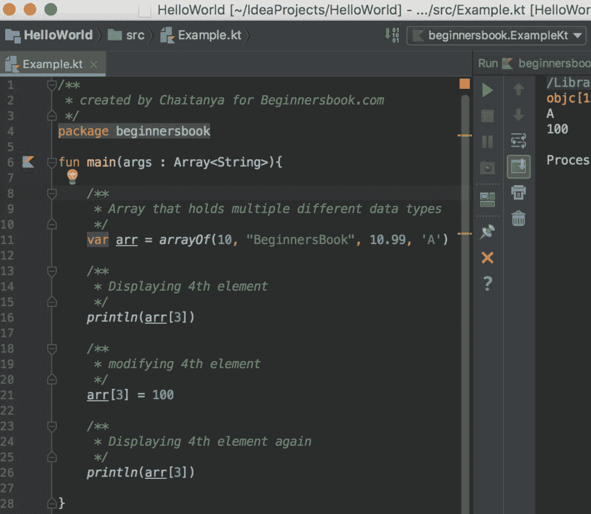
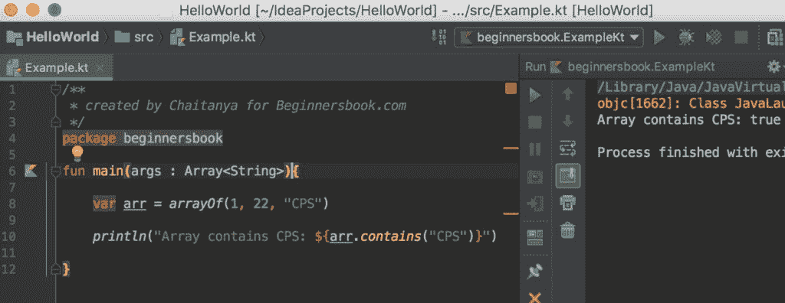

# Kotlin 数组

> 原文： [https://beginnersbook.com/2019/02/kotlin-array/](https://beginnersbook.com/2019/02/kotlin-array/)

Kotlin 中的数组能够存储不同数据类型的多个值。当然，如果我们想要，我们可以限制数组保存特定数据类型的值。在本指南中，我们将讨论 Kotlin 中的数组。

## Kotlin 数组声明

包含多种不同数据类型的数组。

```
var arr = arrayOf(10, "BeginnersBook", 10.99, 'A')
```

只能保存整数的数组

```
var arr = arrayOf<Int>(1, 22, 55)
```

只能保存字符串的数组

```
var arr2 = arrayOf<String>("ab", "bc", "cd")
```

## 访问 Kotlin 中的数组元素

在下面的例子中，我们有一个数组`arr`，它有多个不同数据类型的元素，我们使用索引（`arr[3]`）显示数组的第四个元素。由于数组是可变的，我们可以更改元素的值，我们在下面的示例中显示了该值。

```
/**
 * created by Chaitanya for Beginnersbook.com
 */
package beginnersbook

fun main(args : Array<String>){

    /**
     * Array that holds multiple different data types
     */
    var arr = arrayOf(10, "BeginnersBook", 10.99, 'A')

    /**
     * Displaying 4th element
     */
    println(arr[3])

    /**
     * modifying 4th element
     */
    arr[3] = 100

    /**
     * Displaying 4th element again
     */
    println(arr[3])

}
```

**输出：**



## Kotlin 数组 set（）和 get（）函数

### 得到（）

在上面的例子中，我们使用以下语句来访问数组的第 4 个元素的值。

```
arr[3]
```

我们可以使用 get 函数重写相同的语句，如下所示：

```
arr.get(3)
```

### 组（）

在上面的例子中，我们使用以下语句来修改数组中第 4 个元素的值。

```
arr[3] = 100
```

我们可以使用 set（）函数重写相同的语句，如下所示：

```
arr.set(3,100)
```

## 数组的大小

我们可以很容易地找到这样的数组的大小：

```
/**
 * created by Chaitanya for Beginnersbook.com
 */
package beginnersbook

fun main(args : Array<String>){

    var arr = arrayOf(1, 2, 3, 4, 5)

    println("Size of Array arr is: ${arr.size}")

}
```

**输出：**

```
Size of Array arr is: 5
```

## 检查数组中的元素

我们还可以使用 contains（）检查数组中是否存在元素。

```
/**
 * created by Chaitanya for Beginnersbook.com
 */
package beginnersbook

fun main(args : Array<String>){

    var arr = arrayOf(1, 22, "CPS")

    println("Array contains CPS: ${arr.contains("CPS")}")

}
```

**输出：**



## Kotlin Array first（）和 last（）函数

我们可以使用 first（）和 last（）函数轻松找出数组的第一个和最后一个元素。

```
/**
 * created by Chaitanya for Beginnersbook.com
 */
package beginnersbook

fun main(args : Array<String>){

    var arr = arrayOf(1, 22, "CPS")

    println("First Element: ${arr.first()}")
    println("Last Element: ${arr.last()}")

}
```

**输出：**

```
First Element: 1
Last Element: CPS
```

## 查找数组中元素的索引

我们可以使用 indexOf（）函数找出数组中特定元素的索引。

```
/**
 * created by Chaitanya for Beginnersbook.com
 */
package beginnersbook

fun main(args : Array<String>){

    var arr = arrayOf(1, 22, "CPS")

    println("Index of 22: ${arr.indexOf(22)}")

}
```

**输出：**

```
Index of 22: 1
```