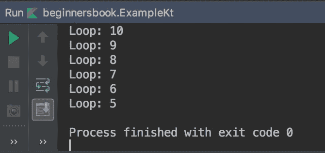

# Kotlin while Loop 带有例子

> 原文： [https://beginnersbook.com/2019/02/kotlin-while-loop/](https://beginnersbook.com/2019/02/kotlin-while-loop/)

**while 循环**用于重复迭代代码块，只要给定条件返回 true 即可。在本指南中，我们将学习如何在示例的帮助下使用 while 循环。

## Kotlin 中的一个简单的循环

在下面的示例中，我们使用 while 循环显示 10 到 5 之间的值。这里需要注意的重点是计数器，在下面的例子中是变量 num，对于上升循环，计数器值应该增加以满足给定条件，对于下降循环，计数器值应该在每次迭代中减少，就像我们在以下示例。

```
/**
 * created by Chaitanya for Beginnersbook.com
 */

package beginnersbook

fun main(args : Array<String>){

    var num = 10

    while(num>=5){
        println("Loop: $num")
        num--
    }
}
```

**输出：**


## 无限循环

如果 while 循环中指定的条件永远不会返回 false，那么循环无限迭代并且永远不会停止，而 while 循环被称为无限循环。在编写代码时我们应该始终避免这种情况。让我们看几个无限 while 循环的例子。

1.由于条件始终为真，因此无限运行。

```
while (true){  
   println("loop")  
}
```

2.在这个 while 循环中，我们递增计数器`num`，计数器初始值为 10，并且我们在每次迭代时增加它，这意味着指定的条件 num&gt; = 5 将始终保持为真并且循环将永远不会停止。

```
var num = 10

while(num>=5){
   println("Loop: $num")
   num++
}
```

3.以下循环也将是无限循环，因为条件将始终保持为真，因为我们正在减小 num 的值，这意味着将始终满足条件 num&lt; = 10。

```
var num = 5

while(num<=10){
   println("Loop: $num")
   num--
}
```