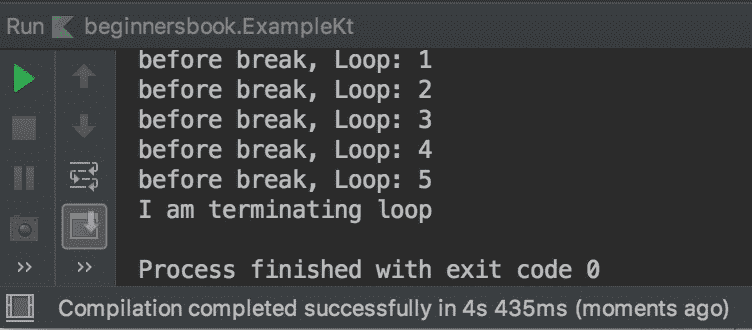
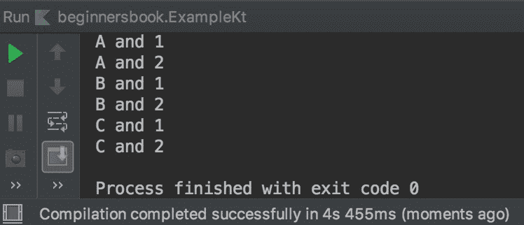

# Kotlin break 以示例声明

> 原文： [https://beginnersbook.com/2019/02/kotlin-break/](https://beginnersbook.com/2019/02/kotlin-break/)

**break 语句**用于在不评估循环条件的情况下立即终止循环。一旦在循环内遇到 break 语句，循环就立即终止而不执行 break 语句之后的其余语句。在本指南中，我们将了解 break 如何工作，我们还将讨论 break 标签。

## 科特林打破榜样

break 语句通常与[一起使用 if if 表达式](https://beginnersbook.com/2018/09/kotlin-if-else-expression/)。

```
fun main(args : Array<String>){

    for(n in 1..10){
        println("before break, Loop: $n")
        if (n==5) {
            println("I am terminating loop")
            break
        }
    }
}
```

**输出：**



正如您可以在输出中观察到，一旦遇到中断，循环就会终止。

## Kotlin 打破了嵌套循环中的示例

当在嵌套循环中使用 break 时，它会在遇到内部循环时终止它。

```
fun main(args : Array<String>){

    for(ch in 'A'..'C'){
        for (n in 1..4){
            println("$ch and $n")
            if(n==2)
                break
        }
    }
}
```

**输出：**



正如您可以在输出中观察到外部循环永远不会终止，但内部循环终止了 3 次。

## Kotlin 打破标签

让我们谈谈标签吧。与[继续标签](https://beginnersbook.com/2019/02/kotlin-continue-expression-with-examples/)类似，中断标签使我们能够更好地控制在遇到中断时终止哪个循环。

在上面的嵌套循环示例中，内部循环在遇到中断时终止。让我们在标签的帮助下编写一个程序来终止外循环而不是内循环。

```
fun main(args : Array<String>){

    [email protected] for(ch in 'A'..'C'){
        for (n in 1..4){
            println("$ch and $n")
            if(n==2)
                [email protected]
        }
    }
}
```

**输出：**

```
A and 1
A and 2
```

label 的语法很简单我们只需要在循环前面使用任何名称后跟@，我们想要终止，同一名称需要附加前缀为@的 break 关键字，如上例所示。