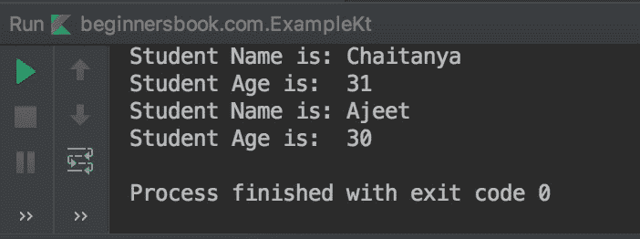
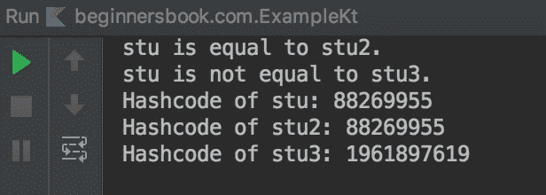
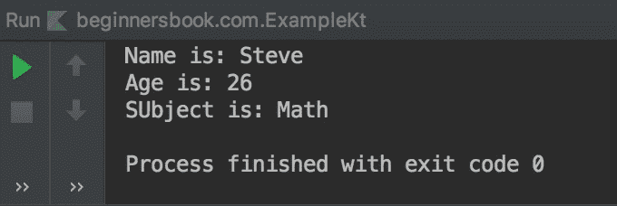

# Kotlin 数据类和示例

> 原文： [https://beginnersbook.com/2019/03/kotlin-data-class/](https://beginnersbook.com/2019/03/kotlin-data-class/)

在 Kotlin 中，您可以创建一个`data`类来保存数据。您希望将类标记为`data`的原因是让编译器知道您正在创建此类来保存数据，然后编译器会自动为您的数据类创建多个函数，这将有助于管理数据。在本指南中，我们将学习数据类和编译器自动生成的函数。

**数据类学生：**

```kotlin
data class Student(val stuName: String, val stuAge: Int)
```

## 在 Kotlin 中自动生成数据类的函数

现在我只是在这里提到函数的名称，我们将在示例的帮助下看到它们中的每一个。
1.  equals（）
2.  hashCode（）
3.  toString（）
4.  copy（）
5.  componentN（）

## Kotlin 数据类要求

为了将类标记为数据，该类必须满足某些要求。要求如下：

1.  数据类的[主构造函数](https://beginnersbook.com/2019/03/kotlin-constructors/)必须至少有一个参数。此外，参数标记为 val 或 var。
2.  班级不能标记为开放，抽象，密封或内部。
3.  该类可以扩展（继承）其他类，它还可以实现其他接口。

## Kotlin 数据类示例

在下面的示例中，我们有一个 Student 类，我们将其标记为数据类。由于我们已将此类声明为`data`，因此编译器已自动为此类生成了多个函数，如`copy()`，`toString()`，`equals()`等，我们将在接下来的几个示例中讨论这些函数。

```kotlin
data class Student(val name: String, val age: Int)

fun main(args: Array<String>) {
    val stu = Student("Chaitanya", 31)
    val stu2 = Student("Ajeet", 30)
    println("Student Name is: ${stu.name}")
    println("Student Age is:  ${stu.age}")
    println("Student Name is: ${stu2.name}")
    println("Student Age is:  ${stu2.age}")
}
```

**输出：**



## 数据类 hashCode（）和 equals（）方法

如果两个对象在 kotlin 中相同，那么它们具有相同的哈希码，我们可以使用 hashCode（）方法获得。
方法 equals（）返回 true 或 false。如果两个对象的 hashCode（）相等，则`equals()`返回 true，否则返回 false。

```kotlin
data class Student(val name: String, val age: Int)

fun main(args: Array<String>) {
    val stu = Student("Chaitanya", 31)
    val stu2 = Student("Chaitanya", 31)
    val stu3 = Student("Ajeet", 30)
    if (stu.equals(stu2) == true)
        println("stu is equal to stu2.")
    else
        println("stu is not equal to stu2.")

    if (stu.equals(stu3) == true)
        println("stu is equal to stu3.")
    else
        println("stu is not equal to stu3.")

    println("Hashcode of stu: ${stu.hashCode()}")
    println("Hashcode of stu2: ${stu2.hashCode()}")
    println("Hashcode of stu3: ${stu3.hashCode()}")
}
```

**输出：**



## 数据类 copy（）方法

通过在数据类中使用 copy（）方法，我们可以复制其他对象的一些属性。让我们举个例子。这里我们有一个 Student 类的对象`stu`，其中包含学生“Steve”的名称，年龄和主题细节，我们创建了另一个名为“Lucy”的对象`stu2`并复制了对象的年龄和主题细节`stu`使用数据类的 copy（）方法。

```kotlin
data class Student(val name: String, val age: Int, val sub: String)

fun main(args: Array<String>) {
    val stu = Student("Steve", 26, "Math")

    // copying the age and subject from object stu
    val stu2 = stu.copy(name = "Lucy")

    println("stu: Name ${stu.name}, Age ${stu.age} & Subject ${stu.sub}")
    println("stu2: Name ${stu2.name}, Age ${stu2.age} & Subject ${stu2.sub}")
}
```

**输出：**


## 数据类 toString（）方法

data 类的 toString（）方法返回对象的 String 表示形式。

```kotlin
data class Student(val name: String, val age: Int, val sub: String)

fun main(args: Array<String>) {
    val stu = Student("Steve", 26, "Math")
    println(stu.toString())
}
```

**输出：**

```kotlin
Student(name=Steve, age=26, sub=Math)
```

## 数据类 component（）方法

数据类的 componentN（）方法将对象解构为多个变量。在下面的例子中，我们有一个 Student 类的对象`stu`，我们使用 componentN（）方法将对象解构为变量数。 component1（）方法返回对象的第一个属性的值，component2（）返回第二个属性的值，依此类推。

```kotlin
data class Student(val name: String, val age: Int, val sub: String)

fun main(args: Array<String>) {
    val stu = Student("Steve", 26, "Math")
    val name = stu.component1()
    val age = stu.component2()
    val sub = stu.component3()
    println("Name is: $name")
    println("Age is: $age")
    println("SUbject is: $sub")
}
```

**输出：**

