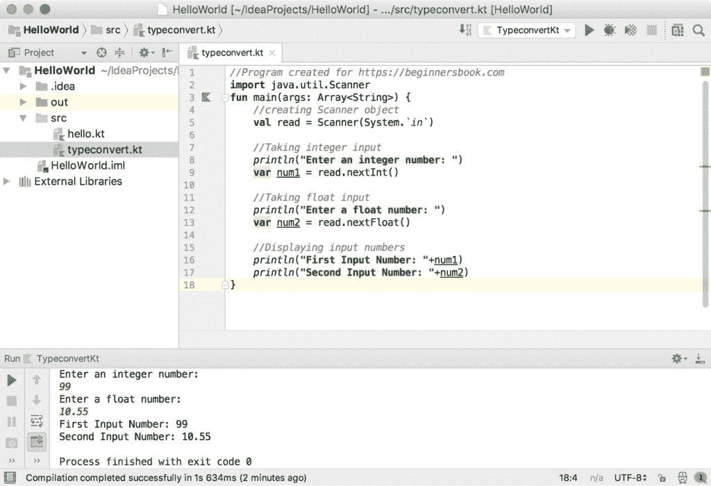

# Kotlin - 如何从用户获取输入

> 原文： [https://beginnersbook.com/2018/09/kotlin-input-from-user/](https://beginnersbook.com/2018/09/kotlin-input-from-user/)

在本教程中，我们将看到**如何在 Kotlin** 中从用户那里获取输入。

## 示例 1：显示用户输入的字符串

在此示例中，我们将从用户获取输入并将其显示在输出中。这里我们使用`readLine()`函数来读取在控制台上输入的字符串。

```
fun main(args: Array<String>) {
    print("Write anything here: ")

    val enteredString = readLine()
    println("You have entered this: $enteredString")
}
```

输出：

```
Write anything here: welcome to beginnersbook.com
You have entered this: welcome to beginnersbook.com
```

## 示例 2：获取输入并将其转换为其他类型

正如我们在上面的例子中看到的那样，`readLine()`函数将输入读作 String。如果我们想要输入不同类型的输入，例如整数，长整数，那么我们需要显式地将输入转换为另一种类型或使用 [java Scanner 类](https://beginnersbook.com/2014/07/java-program-to-get-input-from-user/)。

**将输入作为 String 并将其转换为 int**

这里我们明确地将输入转换为整数。

```
fun main(args: Array<String>) {
    print("Write any number: ")

    val number = Integer.valueOf(readLine())
    println("The entered number is: $number")
}
```

输出：

```
Write any number: 101
The entered number is: 101
```

**使用 Scanner 类**

获取 String 以外的输入在本例中，我们将输入作为整数并分别使用`nextInt()`和`nextFloat()`函数浮点数。类似地，我们可以使用`nextLong()`，`nextDouble()`和`nextBoolean()`方法分别获取长，双和布尔输入。

```
//Program created for https://beginnersbook.com
import java.util.Scanner
fun main(args: Array<String>) {
    //creating Scanner object
    val read = Scanner(System.`in`)

    //Taking integer input
    println("Enter an integer number: ")
    var num1 = read.nextInt()

    //Taking float input
    println("Enter a float number: ")
    var num2 = read.nextFloat()

    //Displaying input numbers
    println("First Input Number: "+num1)
    println("Second Input Number: "+num2)
}
```

输出：

```
Enter an integer number: 
99
Enter a float number: 
10.55
First Input Number: 99
Second Input Number: 10.55
```

