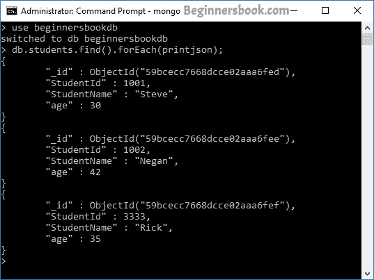
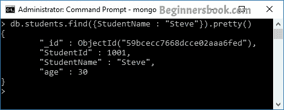
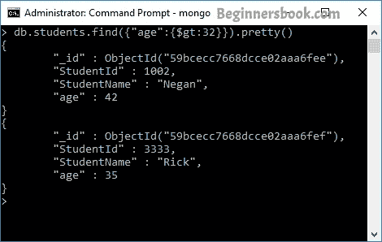

# MongoDB 使用 find（）方法查询文档

> 原文： [https://beginnersbook.com/2017/09/mongodb-query-document-using-find-method/](https://beginnersbook.com/2017/09/mongodb-query-document-using-find-method/)

在我之前的教程中，我使用 find（）方法查询集合中的所有文档。在本教程中，我们将看到 find（）方法的用法，以根据给定的条件查询集合中的文档。让我们开始吧。

## 以 JSON 格式查询所有文档

假设我们在名为`beginnersbookdb`的数据库中有一个集合`students`。要获取所有文档，我们使用此命令：

```
db.students.find()
```

但是，我们获得的输出不是任何格式且不太可读。为了提高可读性，我们可以使用以下命令格式化 JSON 格式的输出：

```
db.students.find().forEach(printjson);
```

或者只是使用 pretty（） - 它做同样的事情。

```
db.students.find().pretty()
```

正如您在下面的屏幕截图中看到的那样，文档是 JSON 格式的。


## 根据条件查询文档

我们可以根据条件获取所选文档，而不是从集合中获取所有文档。

**平等标准：**
例如：我想从学生集合中获取“史蒂夫”的数据。这个命令应该是：

```
db.students.find({StudentName : "Steve"}).pretty()
```

此命令返回与给定条件匹配的文档。


**大于标准：**
语法：

```
db.collection_name.find({"field_name":{$gt:criteria_value}}).pretty()
```

例如：我想获取有年龄的学生的详细信息&gt; 32 那么查询应该是：

```
db.students.find({"age":{$gt:32}}).pretty()
```

我有两个符合条件的文件，如下面的屏幕截图所示：


**小于标准：**
语法：

```
db.collection_name.find({"field_name":{$lt:criteria_value}}).pretty()
```

示例：查找 ID 小于 3000 的所有学生。此标准的命令为：

```
db.students.find({"StudentId":{$lt:3000}}).pretty()
```

输出：

```
> db.students.find({"StudentId":{$lt:3000}}).pretty()
{
        "_id" : ObjectId("59bcecc7668dcce02aaa6fed"),
        "StudentId" : 1001,
        "StudentName" : "Steve",
        "age" : 30
}
{
        "_id" : ObjectId("59bcecc7668dcce02aaa6fee"),
        "StudentId" : 1002,
        "StudentName" : "Negan",
        "age" : 42
}
```

**不等于标准：**
语法：

```
db.collection_name.find({"field_name":{$ne:criteria_value}}).pretty()
```

示例：查找 id 不等于 1002 的所有学生。此条件的命令为：

```
db.students.find({"StudentId":{$ne:1002}}).pretty()
```

Output:

```
> db.students.find({"StudentId":{$ne:1002}}).pretty()
{
        "_id" : ObjectId("59bcecc7668dcce02aaa6fed"),
        "StudentId" : 1001,
        "StudentName" : "Steve",
        "age" : 30
}
{
        "_id" : ObjectId("59bcecc7668dcce02aaa6fef"),
        "StudentId" : 3333,
        "StudentName" : "Rick",
        "age" : 35
}
```

以下是另外两个标准：

**大于等于标准：**

```
db.collection_name.find({"field_name":{$gte:criteria_value}}).pretty()
```

**小于等于标准：**

```
db.collection_name.find({"field_name":{$lte:criteria_value}}).pretty()
```

> 我们在所有命令末尾添加的 pretty（）方法不是必需的。它仅用于格式化目的。