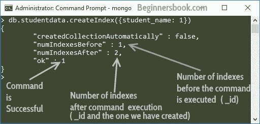
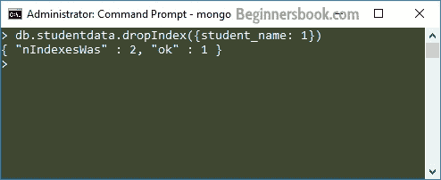
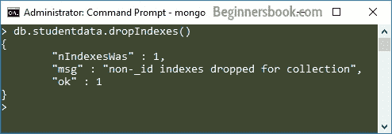

# MongoDB 索引教程

> 原文： [https://beginnersbook.com/2017/09/mongodb-indexing-tutorial-with-example/](https://beginnersbook.com/2017/09/mongodb-indexing-tutorial-with-example/)

MongoDB 中的**索引**是一种特殊的数据结构，它保存创建索引的少量文档字段的数据。索引提高了数据库中搜索操作的速度，因为不是搜索整个文档，而是对仅包含少量字段的索引执行搜索。另一方面，由于索引使用了额外的写入和额外数据空间，索引太多会妨碍插入，更新和删除操作的性能。

## 如何在 MongoDB 中创建索引

**语法：**

```js
db.collection_name.createIndex({field_name: 1 or -1})
```

值 1 表示升序，-1 表示降序。

例如，我有一个集合`studentdata`。此集合中的文档包含以下字段：`student_name`，`student_id`和`student_age`

假设我想按升序在`student_name`字段上创建索引：

```js
db.studentdata.createIndex({student_name: 1})
```

**输出：**

```js
{
        "createdCollectionAutomatically" : false,
        "numIndexesBefore" : 1,
        "numIndexesAfter" : 2,
        "ok" : 1
}
```



我们在`student_name`上创建了索引，这意味着当有人根据`student_name`搜索文档时，搜索速度会更快，因为索引将用于此搜索。因此，在字段中创建将在集合中频繁搜索的索引非常重要。

## MongoDB - 查找集合中的索引

我们可以使用`getIndexes()`方法来查找在集合上创建的所有索引。此方法的语法是：

```js
db.collection_name.getIndexes()
```

因此，要获取`studentdata`集合的索引，命令将是：

```js
> db.studentdata.getIndexes()
[
        {
                "v" : 2,
                "key" : {
                        "_id" : 1
                },
                "name" : "_id_",
                "ns" : "test.studentdata"
        },
        {
                "v" : 2,
                "key" : {
                        "student_name" : 1
                },
                "name" : "student_name_1",
                "ns" : "test.studentdata"
        }
]
```

输出显示我们在此集合中有两个索引。在`_id`上创建的默认索引以及我们在`student_name`字段上创建的索引。

## MongoDB - 删除集合中的索引

您可以删除特定索引或所有索引。

**删除特定索引：**

为此，使用了`dropIndex()`方法。

```js
db.collection_name.dropIndex({index_name: 1})
```

让我们删除我们在集合`studentdata`中的`student_name`字段上创建的索引。这个命令：

```js
db.studentdata.dropIndex({student_name: 1})
```



`nIndexesWas`：显示执行此命令之前有多少索引

`ok: 1`：表示命令执行成功。

**删除所有索引：**

要删除集合的所有索引，我们使用`dropIndexes()`方法。

`dropIndexs()`方法的语法：

```js
db.collection_name.dropIndexes()
```

假设我们想要删除`studentdata`集合的所有索引。

```js
db.studentdata.dropIndexes()
```



消息“为集合删除的非`_id`索引”表示默认索引`_id`仍将保留，不能删除。这意味着使用此方法我们只能删除我们创建的索引，我们不能删除在`_id`字段上创建的默认索引。