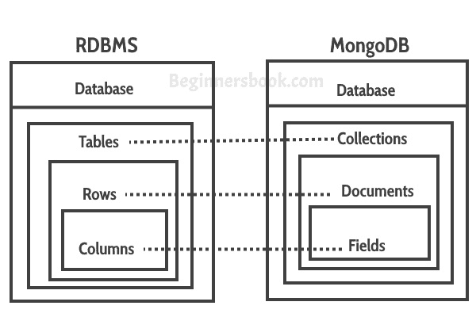
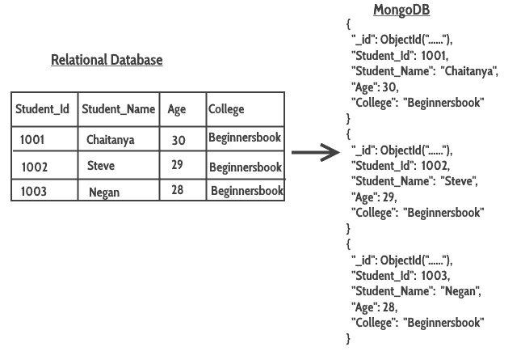

# 将关系数据库映射到 MongoDB

> 原文： [https://beginnersbook.com/2017/09/mapping-relational-databases-to-mongodb/](https://beginnersbook.com/2017/09/mapping-relational-databases-to-mongodb/)

如果您来自关系数据库背景，那么您可能很难将 RDBMS 术语与 MongoDB 相关联。在本指南中，我们将看到关系数据库和 MongoDB 之间的映射。

## 将关系数据库映射到 MongoDB

MongoDB 中的
**集合**等同于 RDBMS 中的表。
**MongoDB 中的文档**等同于 RDBMS 中的行。
**MongoDB 中的字段**等同于 RDBMS 中的列。

> 字段（键和值对）存储在文档中，文档存储在集合中，集合存储在数据库中。

**这是文档在 MongoDB 中的样子：**正如您所看到的，这与 RDBMS 中的行类似。唯一的区别是它们是 JSON 格式。

## 表与集合

在这里，我们将看到关系数据库中的表如何在 MongoDB 中查找。如您所见，列被表示为键值对（ [JSON](https://beginnersbook.com/2015/04/json-tutorial/) 格式），行表示为文档。 MongoDB 自动在每个文档中插入一个唯一的 _id（12 字节字段）字段，这个字段用作每个文档的主键。

关于 MongoDB 的另一个很酷的事情是它支持动态模式，这意味着集合中的一个文档可以有 4 个字段，而另一个文档只有 3 个字段。这在关系数据库中是不可能的。