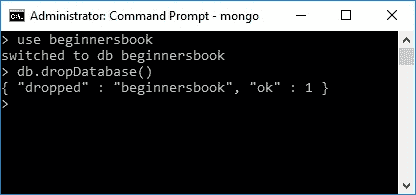
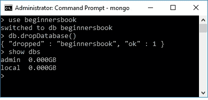

# 删除 MongoDB 中的数据库

> 原文： [https://beginnersbook.com/2017/09/mongodb-drop-database/](https://beginnersbook.com/2017/09/mongodb-drop-database/)

在上一个教程中，我们学习了[如何在 MongoDB](https://beginnersbook.com/2017/09/mongodb-create-database/) 中创建数据库。在这里，我们将看到如何在 MongoDB 中删除数据库。我们使用 db.dropDatabase（）命令删除数据库。删除数据库时应该非常小心，因为这将删除该数据库中的所有数据，包括存储在数据库中的集合和文档。

## MongoDB 删除数据库

删除数据库的语法是：

```
db.dropDatabase()
```

我们在此命令中未指定任何数据库名称，因为此命令将删除当前选定的数据库。让我们看看在 MongoDB 中删除数据库的步骤。

1.  使用 **show dbs** 命令查看数据库列表。

```
> show dbs
admin          0.000GB
beginnersbook  0.000GB
local          0.000GB
```

它显示了我创建的两个默认数据库和一个数据库“beginnersbook”。

2.  键入以下命令切换到需要删除的数据库。

```
use database_name
```

例如，我想删除数据库“beginnersbook”。

```
> use beginnersbook
switched to db beginnersbook
```

> 注意：将上述命令中的数据库名称从`beginnersbook`更改为需要删除的数据库。

3.  现在，当前选择的数据库是`beginnersbook`，因此命令`db.dropDatabase()`将删除此数据库。

```
> db.dropDatabase()
{ "dropped" : "beginnersbook", "ok" : 1 }

```

该命令成功执行并显示操作“已删除”和状态“ok”，这意味着数据库已被删除。



4.  验证是否已成功删除数据库。再次执行 show dbs 命令以查看删除后的数据库列表。


正如您所看到的那样，数据库“beginnersbook”不在列表中，这意味着它已成功删除。