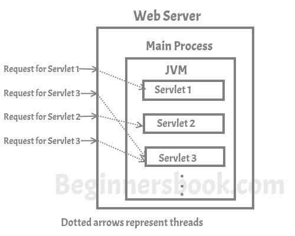
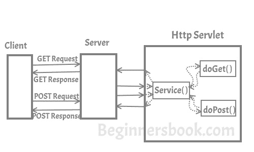

# Servlet API

> 原文： [https://beginnersbook.com/2013/05/servlet-api/](https://beginnersbook.com/2013/05/servlet-api/)

您需要使用 Servlet API 来创建 servlet。使用 API​​时必须记住两个包，包含支持通用 servlet（独立于协议的 servlet）的类的`javax.servlet`包和包含支持 http servlet 的类的`javax.servlet.http`包。你可能想知道什么是泛型和 http servlet，我在本文后面已经解释过了。

**让我们看看包的层次结构：**

```java
java.lang.Object
	|_extended byjavax.servlet.GenericServlet
        	|_extended byjavax.servlet.http.HttpServlet

```

每个 Servlet 必须实现`java.servlet.Servlet`接口，您可以通过扩展以下两个类之一来实现：`javax.servlet.GenericServlet`或`javax.servlet.http.HttpServlet`。第一个用于协议无关的 Servlet，第二个用于 http Servlet。

**servlet 如何工作？**



## 通用 Servlet

如上所述，如果要创建 Generic Servlet，则必须扩展`javax.servlet.GenericServlet`类。 GenericServlet 类有一个抽象的 service（）方法。这意味着 GenericServlet 的子类应始终覆盖 service（）方法。
**签名服务（）方法：**

```java
public abstract void service(ServletRequest request, ServletResponse response)
         throws ServletException, java.io.IOException
```

service（）方法接受两个参数 ServletRequest 对象和 ServletResponse 对象。请求对象告诉 servlet 客户端发出的请求，而响应对象用于将响应返回给客户端。


## HTTP Servlet

如果您创建 Http Servlet，则必须扩展`javax.servlet.http.HttpServlet`类，这是一个抽象类。与 Generic Servlet 不同，HTTP Servlet 不会覆盖 service（）方法。相反，它会覆盖以下一种或多种方法。它必须覆盖以下列表中的至少一个方法：

*   **doGet（）** - 这个方法由 servlet 服务方法调用，用于处理来自客户端的 HTTP GET 请求。 Get 方法用于从服务器获取信息
*   **doPost（）** - 用于向服务器发布信息
*   **doPut（）** - 这个方法类似于 doPost 方法，但与我们向服务器发送信息的 doPost 方法不同，此方法将文件发送到服务器，这类似于从客户端到服务器的 FTP 操作
*   **doDelete（）** - 允许客户端从服务器删除文档，网页或信息
*   **init（）和 destroy（）** - 用于管理 servlet 生命周期内持有的资源
*   **getServletInfo（）** - 返回有关 servlet 的信息，例如作者，版本和版权。

**在 Http Servlet 中，不需要覆盖 service（）方法**，因为此方法将 Http 请求分派给正确的方法处理程序，例如，如果它接收到 HTTP GET 请求，它会将请求分派给 doGet（）方法。



#### javax.servlet 包中的接口

*   Servlet 的
*   ServletRequest 中
*   ServletResponse 的
*   的 ServletConfig
*   ServletContext 中
*   SingleThreadModel 的
*   RequestDispatcher 的
*   ServletRequestListener
*   ServletRequestAttributeListener
*   的 ServletContextListener
*   ServletContextAttributeListener
*   过滤
*   一个 FilterConfig
*   FilterChain

#### javax.servlet 包中的类

*   GenericServlet 类
*   ServletInputStream
*   ServletOutputStream 的
*   的 ServletException
*   了 ServletRequestWrapper
*   ServletRequestEvent
*   了 ServletResponseWrapper
*   ServletContextEvent
*   ServletRequestAttributeEvent
*   ServletContextAttributeEvent
*   用 UnavailableException

#### javax.servlet.http 包中的接口

*   HttpSession 中
*   HttpServletRequest 的
*   HttpServletResponse 的
*   HttpSessionAttributeListener
*   HttpSessionListener
*   了 HttpSessionBindingListener
*   HttpSessionActivationListener
*   HttpSessionContext

#### javax.servlet.http 包中的类

*   HttpServlet 的
*   曲奇饼
*   HttpSessionEvent
*   HttpSessionBindingEvent
*   了 HttpServletRequestWrapper
*   HttpServletResponseWrapper
*   HttpUtils

**参考文献：**

1.  [javax.servlet 官方 Servlet API 文档](https://docs.oracle.com/cd/E17802_01/products/products/servlet/2.5/docs/servlet-2_5-mr2/javax/servlet/package-summary.html)
2.  [java.servlet.http API 文档](https://docs.oracle.com/cd/E17802_01/products/products/servlet/2.5/docs/servlet-2_5-mr2/javax/servlet/http/package-tree.html)