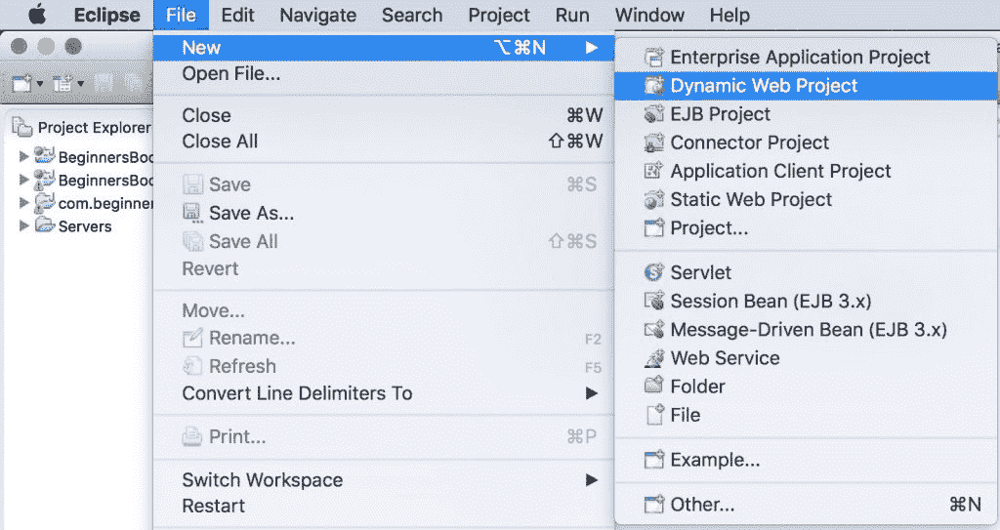
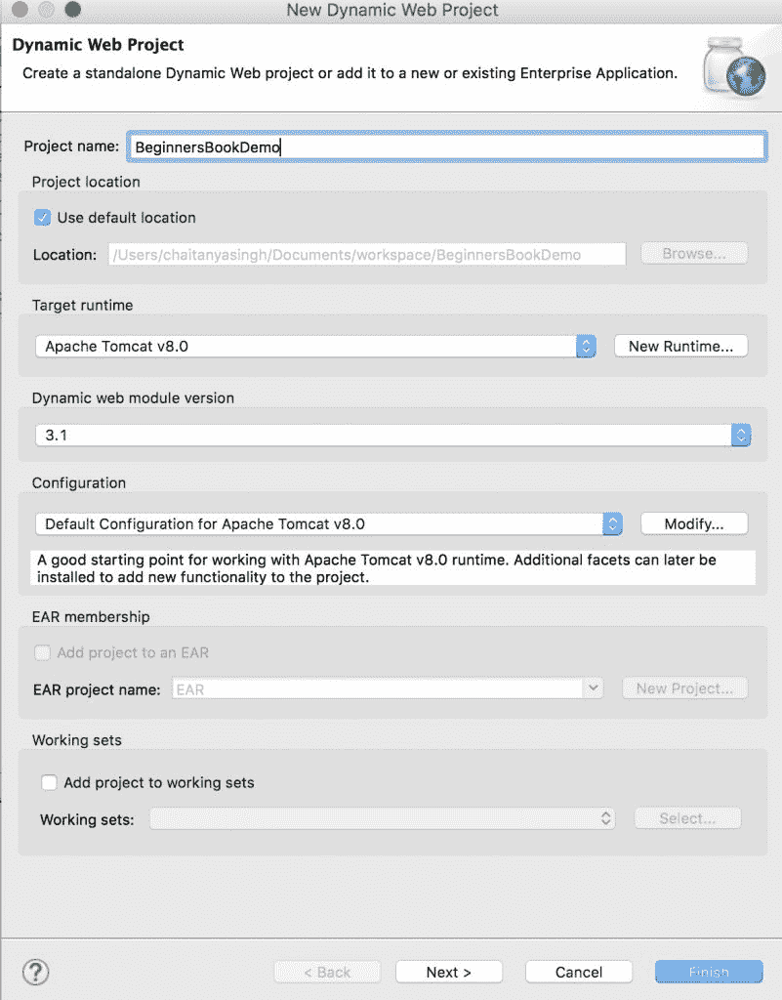
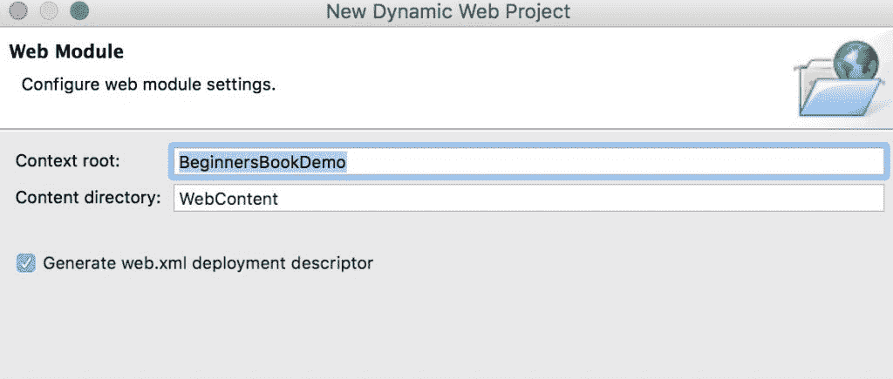
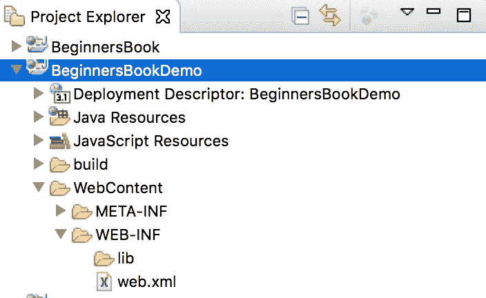
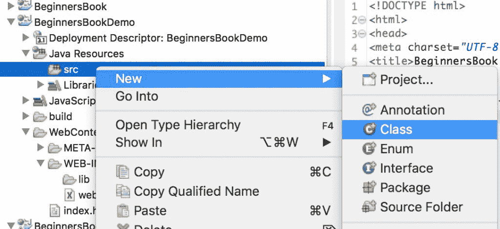
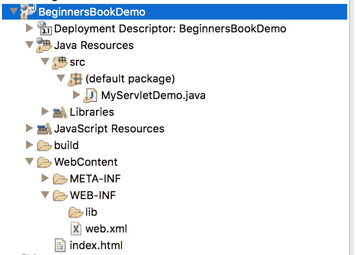
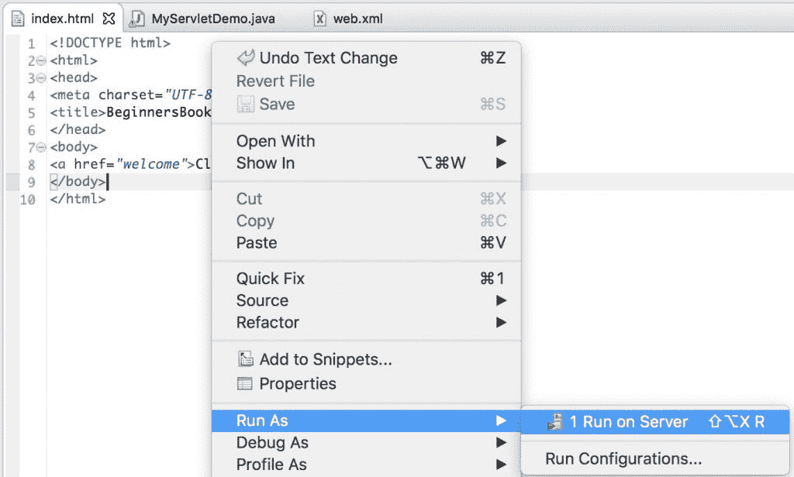
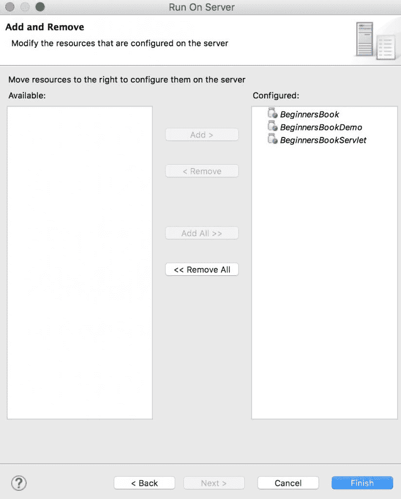

# 如何在 Eclipse IDE 中创建和运行 Servlet

> 原文： [https://beginnersbook.com/2017/07/how-to-create-and-run-servlet-in-eclipse-ide/](https://beginnersbook.com/2017/07/how-to-create-and-run-servlet-in-eclipse-ide/)

这是安装 Eclipse，设置 apache tomcat 服务器和运行第一个 hello world servlet 应用的完整指南。

## 下载 Eclipse IDE

**在 Windows 上安装 Eclipse**
转到此链接 [https://www.eclipse.org/downloads](https://www.eclipse.org/downloads) 。在“获取 Eclipse Oxygen”下单击“下载软件包”❯下载“Eclipse IDE for Java Developers”。您会在右侧看到两个选项（32 位和 64 位），如果系统是 32 位，则单击 32 位，否则单击 64 位。这将在您的系统上下载压缩文件。

要安装 Eclipse，请解压缩下载的文件并将解压缩的文件夹复制到所需的位置。

**在 Mac OS X 上安装 Eclipse**
转到此链接 [https://www.eclipse.org/downloads](https://www.eclipse.org/downloads) 。在“获取 Eclipse Oxygen”下单击“下载软件包”❯下载“Eclipse IDE for Java Developers”。要下载点击 64 位，它将下载一个 TAR 文件。

下载完成后，双击 TAR 文件，它会将文件的内容提取到一个文件夹中。将文件夹拖到“Applications”文件夹。

**要启动 Eclipse** ，请单击 Eclipse 文件夹中的 Eclipse 图标。 Mac 用户可以将其拖到停靠区域以从桌面快速启动 Eclipse，类似 Windows 可以在桌面上创建 Eclipse 的快捷方式。

## 在 Eclipse 中安装和配置 Apache tomcat 服务器

要在 Eclipse IDE 中运行 Servlet，您需要在 Eclipse IDE 中配置 Apache tomcat Server。

> 如果您没有它，请参阅本教程：[如何在 Eclipse IDE](https://beginnersbook.com/2017/06/how-to-configure-apache-tomcat-server-in-eclipse-ide/) 中下载和配置 Apache Tomcat 服务器。

注意：我上面提供的链接属于 JSP 教程，但 Servlet 的步骤也是如此。

## 在 Eclipse IDE 中创建 Servlet

### 第 1 步：创建项目：

让我们在 Eclipse 中创建一个 Servlet 应用。打开 Eclipse，然后单击文件❯新建❯单击动态 Web 项目。


> 如果您在 Eclipse 中没有看到动态 Web 项目选项，请参阅本教程：[如何修复 Eclipse 问题中缺少的“动态 Web 项目”](https://beginnersbook.com/2017/06/how-to-fix-dynamic-web-project-missing-in-eclipse-issue/)

提供项目名称，然后单击下一步


勾选显示**生成 web.xml 部署描述符**
的复选框

**初始项目结构：**
项目创建后，层次结构（项目结构）如下所示：


### 第 2 步：创建 Servlet 类：

我们通过扩展 HttpServlet 类来创建一个 Http Servlet。右键单击 src 文件夹并创建一个新的类文件，将该文件命名为 MyServletDemo。文件路径应如下所示：Java Resources / src / default package / MyServletDemo.java

**MyServletDemo.java**

```java
import java.io.*;
import javax.servlet.*;
import javax.servlet.http.*;

// Extend HttpServlet class to create Http Servlet
public class MyServletDemo extends HttpServlet {

   private String mymsg;

   public void init() throws ServletException {
      mymsg = "Hello World!";
   }

   public void doGet(HttpServletRequest request, 
      HttpServletResponse response)
      throws ServletException, IOException 
   {

      // Setting up the content type of webpage
      response.setContentType("text/html");

      // Writing message to the web page
      PrintWriter out = response.getWriter();
      out.println("<h1>" + mymsg + "</h1>");
   }

   public void destroy() {
      /* leaving empty for now this can be
       * used when we want to do something at the end
       * of Servlet life cycle
       */
   }
}
```

### 第 3 步：创建一个 html 页面来调用网页上的 servlet 类

我们正在创建一个 html 文件，一旦我们点击网页上的链接就会调用 servlet。在 WebContent 文件夹中创建此文件。文件的路径应如下所示：WebContent / index.html
**index.html**

```java
<!DOCTYPE html>
<html>
<head>
<meta charset="UTF-8">
<title>BeginnersBook Servlet Demo</title>
</head>
<body>
<a href="welcome">Click to call Servlet</a>
</body>
</html>

```

**编辑 web.xml 文件**
此文件可在此路径 WebContent / WEB-INF / web.xml 中找到。在此文件中，我们将使用特定 URL 映射 Servlet。由于我们在单击 index.html 页面上的链接时调用欢迎页面，因此我们将欢迎页面映射到我们上面创建的 Servlet 类。

```java
<web-app>
<display-name>BeginnersBookDemo</display-name>
<welcome-file-list>
<welcome-file>index.html</welcome-file>
<welcome-file>index.htm</welcome-file>
<welcome-file>index.jsp</welcome-file>
<welcome-file>default.html</welcome-file>
<welcome-file>default.htm</welcome-file>
<welcome-file>default.jsp</welcome-file>
</welcome-file-list>

<servlet>
<servlet-name>MyHttpServletDemo</servlet-name>
<servlet-class>MyServletDemo</servlet-class>
</servlet>

<servlet-mapping>
<servlet-name>MyHttpServletDemo</servlet-name>
<url-pattern>/welcome</url-pattern>
</servlet-mapping>

</web-app>

```

**最终项目结构**


**运行项目：**
右键单击 index.html，在服务器上运行。


单击“全部添加”以在服务器上部署项目。单击完成


**输出：**


单击链接后，您将看到此屏幕：
